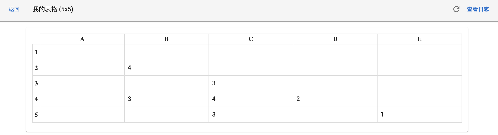
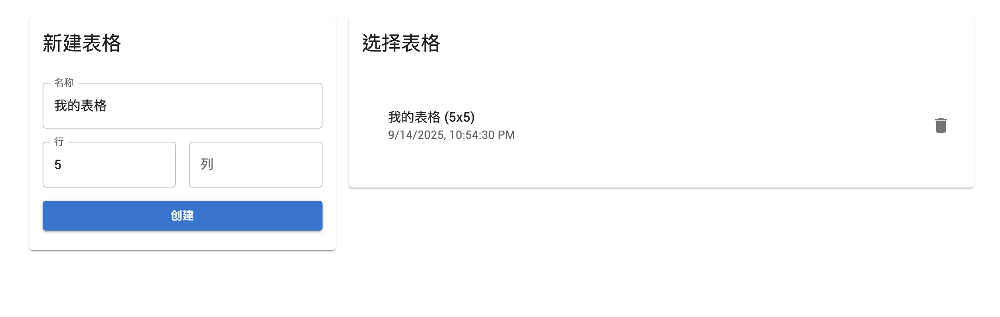

## 面试题：Node.js 全栈开发实战 —— 协作在线表格应用

### 题目描述

请使用 **Node.js** 作为后端技术栈，**SQLite** 作为数据库，开发一个简易的“在线协作填写表格”网页应用。该应用需支持多个用户同时编辑同一张表格，并实时同步更新内容（可通过轮询或简单的 WebSocket 实现）。

#### 功能要求

1. **用户身份管理**
   - 用户可通过昵称加入协作（无需注册登录，昵称唯一即可）。
   - 用户如果设定了密码，用户必须输入正确的密码才能编辑表格内容。

2. **表格管理**
   - 用户可创建新的表格，每个表格有唯一标识和名称。
   - 用户可选择已存在的表格进行协作编辑。
   - 可以删除表格。

3. **表格内容协作**
   - 表格为二维结构（如 5 行 5 列）。
   - 表格内容可被多用户同时编辑，内容需实时同步。
   - 可简单实现实时同步，如：页面轮询、或利用 WebSocket 广播变更。
   - 为表格单元格增加日志，显示是由哪个用户在编辑。
   - 支持表格尺寸可配置，如支持 10×10 或自定义行列数。
   - 实现简单的操作日志（如：谁在什么时间改动了哪个单元格）。

4. **技术要求**
   - 后端使用 Node.js（Express/Koa 等框架不限），数据库用 SQLite（可用 sqlite3、better-sqlite3 等库）。
   - 前端可用 React/Vue/原生 HTML+JS 等任意方式。
   - 前后端需有基本的接口设计，数据格式清晰。
   - 项目结构分明，代码规范。

#### 提交内容

- 清晰的项目目录结构说明
- 数据库设计说明（表结构）
- 简要的接口说明
- 项目核心代码（可精简，但必须能跑通主流程）

#### 示例界面（仅供参考）

|    | A   | B   | C   | D   | E   |
|----|-----|-----|-----|-----|-----|
| 1  |     |     |     |     |     |
| 2  |     |     |     |     |     |
| 3  |     |     |     |     |     |
| 4  |     |     |     |     |     |
| 5  |     |     |     |     |     |

